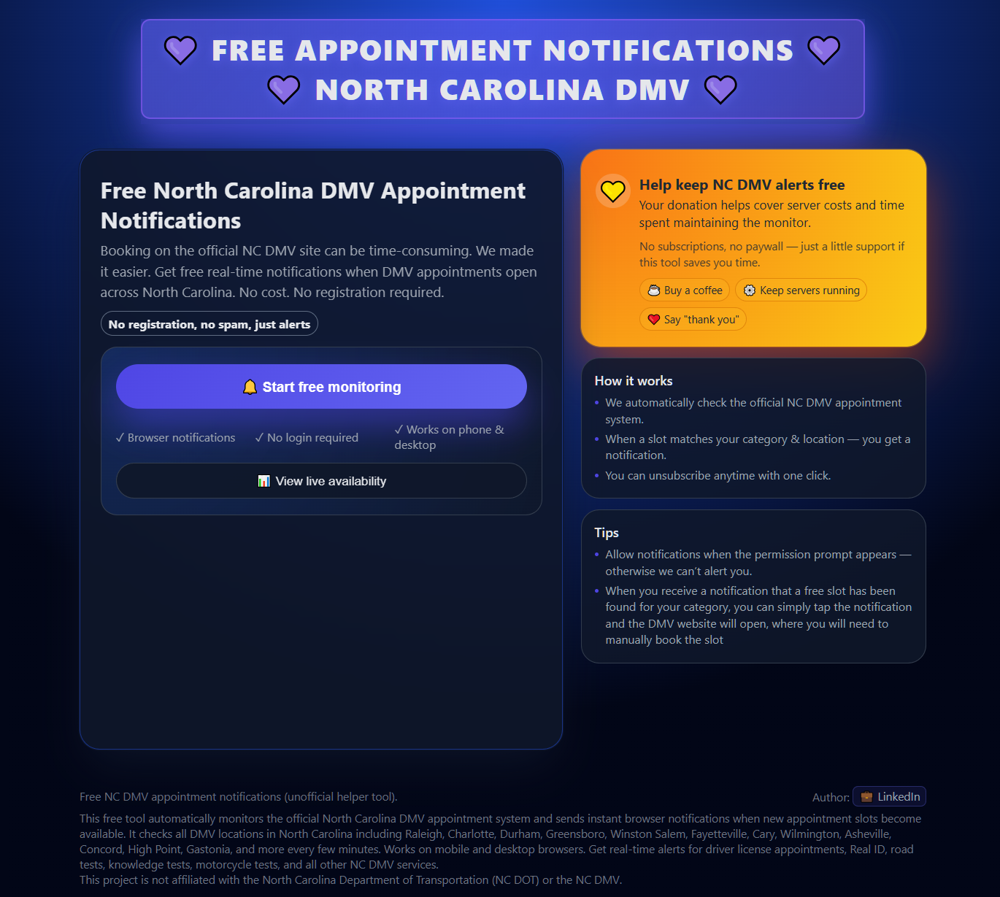
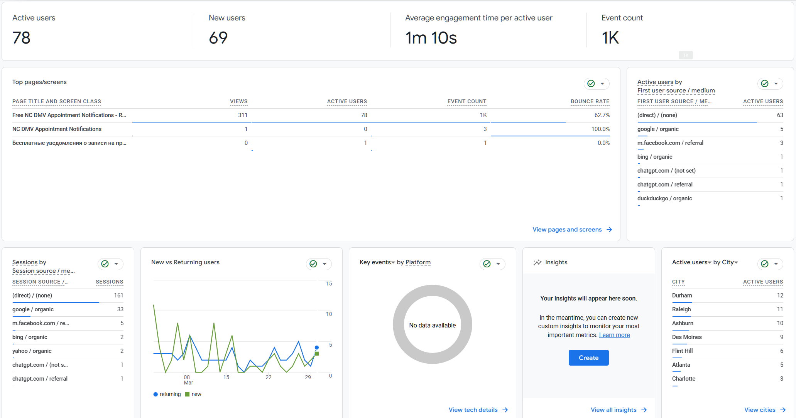
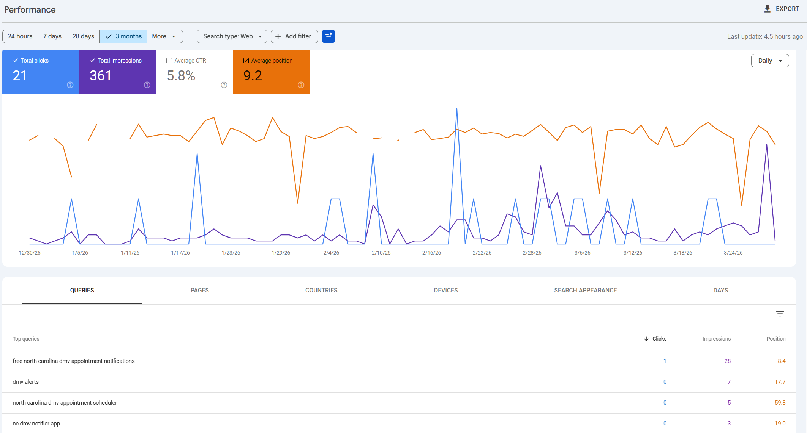
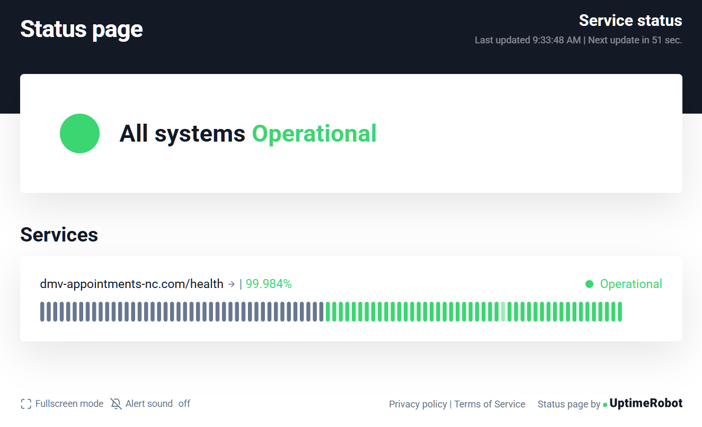
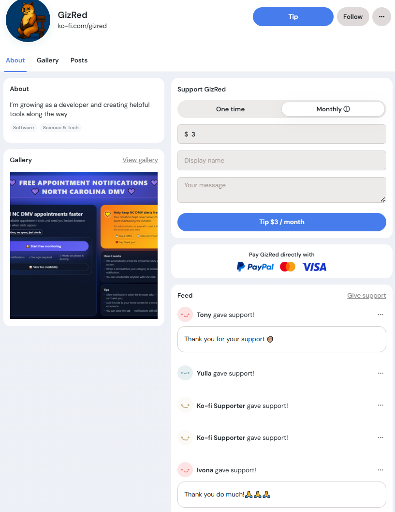
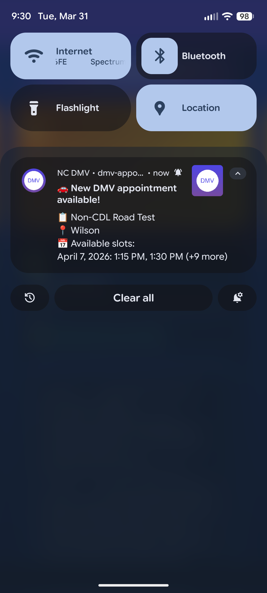

# NC DMV Appointment Monitor

> Live production project · Running since November 2025

**🌐 Live Demo:** https://dmv-appointments-nc.com/

**📊 Service Status:** https://stats.uptimerobot.com/k9YORiE075/802351503

---

**Live Demo — dmv-appointments-nc.com**

---

## Origin Story

In July 2025 I relocated to North Carolina. Like thousands of new residents,
I immediately ran into the same problem — booking a DMV appointment was nearly
impossible. Every available slot was 3+ months out. I tried 4 times and failed.

So I wrote a script. It monitored the DMV scheduler and caught an open slot
within 3 days — for both me and my wife. We got our Driver IDs without waiting months.

After that I decided to turn it into a proper free tool and help others in the
same situation. At the time, similar services existed but charged money. I built
this one completely free.

The project has been running continuously since November 2025 and has helped
real people across North Carolina book DMV appointments faster.

---

## Production Stats

> Last updated: March 2026

**Google Analytics — March 2026 (last 28 days)**

--

**Google Search Console — last 3 months**

--

**UptimeRobot — Service Status**

- **78 active users** in the past 28 days
- **361 impressions** in Google Search over 3 months
- **Average position 9.2** in Google Search
- **99.984% uptime** since launch
- Organic traffic from Google, Bing, DuckDuckGo, Facebook, ChatGPT
- Real users from Durham, Raleigh, Charlotte, Atlanta and other NC cities
- Voluntary donations received via Ko-fi from grateful users

--

**Ko-fi — Voluntary Support from Users**

---

## What It Does

The application continuously monitors the official North Carolina DMV appointment
scheduling website and delivers instant browser push notifications to users when
new appointment slots become available for selected categories and locations.

**Push notification example**

---

## Overview

Production-ready pet project designed to demonstrate backend engineering,
automation, and system design skills using Python and FastAPI.

The system consists of:
- an asynchronous monitoring service built with Playwright
- a FastAPI backend API
- a PostgreSQL persistence layer
- a Progressive Web App frontend with Push Notifications
- a CI/CD pipeline with automated testing and deployment

---

## Deployment

The project is deployed on a Linux VPS and runs as a long-running backend service.
The API server is exposed to the internet via the Caddy web server, which acts as a
reverse proxy and automatically manages HTTPS certificates via Let's Encrypt.

**DNS & Routing:**
- DNS records point to the VPS public IP
- Caddy routes HTTPS traffic to the FastAPI application
- The monitoring service runs as a separate background Docker container

**Infrastructure:**
- All services run in Docker containers orchestrated via Docker Compose
- PostgreSQL data is persisted in a named Docker volume
- CI/CD is handled via GitHub Actions

---

## Architecture

The system is split into three logical components:

**1. Monitoring Service (Playwright)**
Headless browser automation that navigates the NC DMV scheduler,
checks availability across all categories and locations, and writes
results to the shared PostgreSQL database.

**2. Backend API (FastAPI)**
REST API that serves the frontend, manages push subscriptions,
and exposes availability data from the database.

**3. Frontend Client (PWA)**
Progressive Web App that polls the API for availability updates
and receives browser push notifications.

All three components share a single PostgreSQL database running
as a separate Docker container.

---

## Tech Stack

**Backend:**
- Python 3.12
- FastAPI + Pydantic
- PostgreSQL + psycopg2
- pywebpush (VAPID Web Push)
- asyncio

**Monitoring:**
- Playwright (headless Chromium)
- asyncio
- robust retry and error-handling logic

**Frontend:**
- HTML / Vanilla JavaScript
- Service Worker + Push API
- PWA Manifest

**Infrastructure:**
- Docker + Docker Compose
- Caddy (reverse proxy + HTTPS)
- GitHub Actions (CI/CD)
- Linux VPS

---

## CI/CD Pipeline

The project uses GitHub Actions with a three-stage pipeline:

**On every push to main:**
- Lint — flake8 checks the entire codebase
- Test — pytest runs 8 integration tests against the API layer

**On manual trigger (workflow_dispatch):**
- Deploy — SSH into VPS, pull latest code, rebuild Docker images,
  restart containers, run smoke test against `/health` endpoint,
  auto-rollback to previous version if smoke test fails

---

## Project Structure

**api.py**
FastAPI application that:
- serves the frontend (HTML, JS, PWA assets)
- exposes REST API endpoints
- manages push subscriptions (create, get, delete)
- sends Web Push notifications via VAPID

**monitor_service.py**
Long-running monitoring service that:
- navigates the NC DMV scheduler UI with Playwright
- checks all categories, locations, calendars, and time slots
- detects new availability and sends push notifications to matching subscribers
- stores availability snapshots to the shared database
- auto-restarts browser after configurable number of cycles

**database.py**
PostgreSQL data-access layer:
- schema initialization on startup
- subscription CRUD operations
- availability snapshot storage
- cleanup utilities for expired subscriptions

**docker-compose.yml**
Defines three services:
- `dmv-postgres` — PostgreSQL 16 database
- `dmv-api` — FastAPI application
- `dmv-monitor` — Playwright monitoring service

**index.html / app.js / sw.js**
Progressive Web App:
- Service Worker registration and push subscription management
- availability polling and UI state management
- push notification handling and click routing

---

## Database Schema

**subscriptions table:**
- user_id (primary key)
- push_subscription (JSON string)
- categories (JSON array)
- locations (JSON array)
- date_range_days
- created_at
- updated_at
- last_notification_sent

**last_check table:**
- id (serial primary key)
- category
- location_name
- has_slots
- last_checked

---

## Reliability

- automatic retries for UI interactions
- spinner and loading-state detection
- global watchdog timeout with forced browser restart
- screenshot capture on critical errors
- isolation between monitor and API layers via separate Docker containers
- smoke test with automatic rollback on failed deployment

---

## Security

- VAPID-based Web Push authentication
- admin endpoints protected by token header
- PostgreSQL access via dedicated user with password authentication
- secrets stored in environment variables, never committed to repository
- no passwords or personal data stored

---

## Author

Mikhail Drogalev